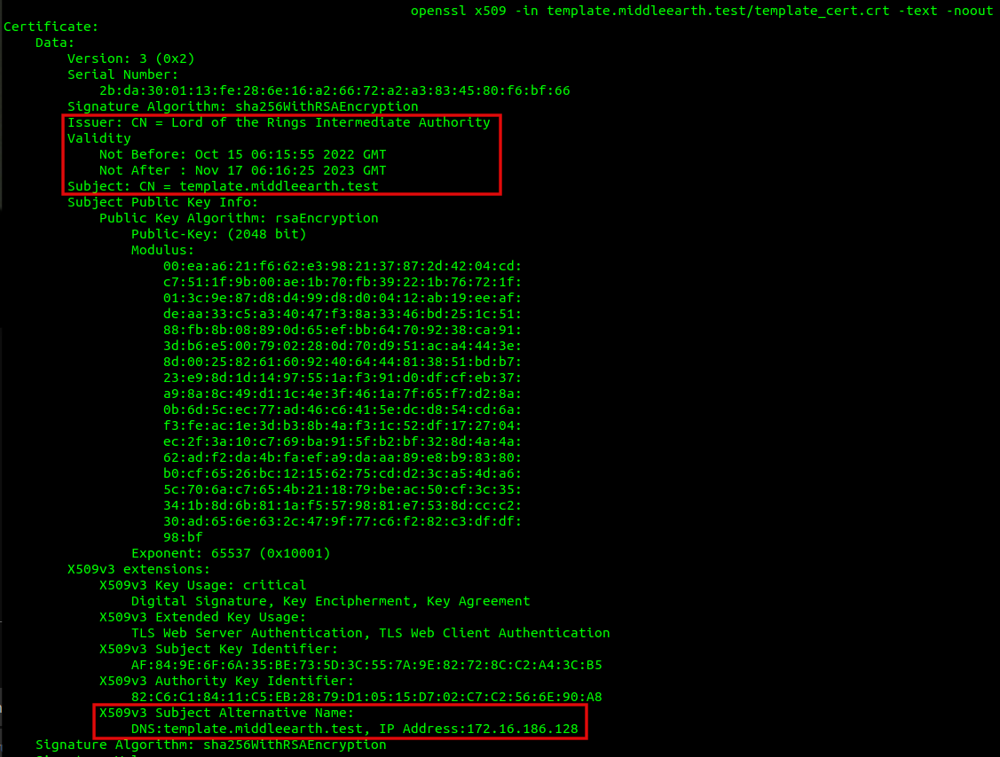
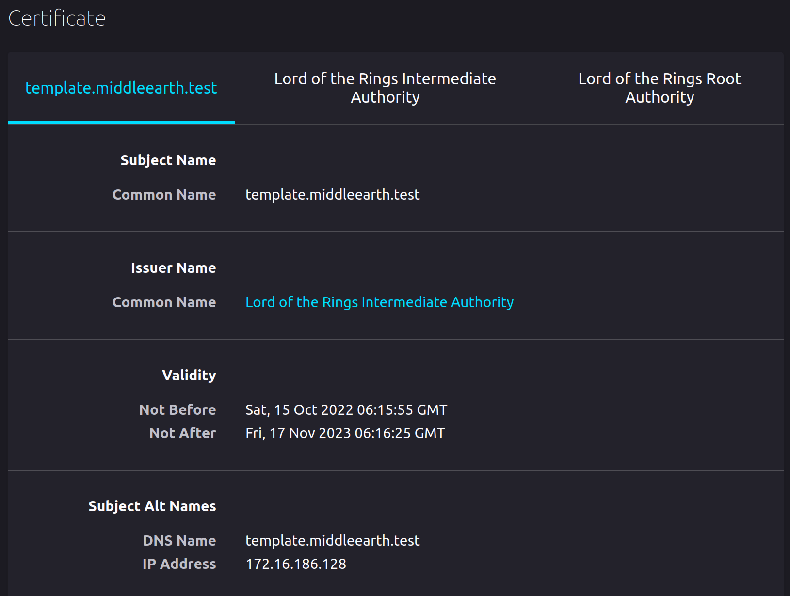
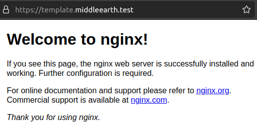
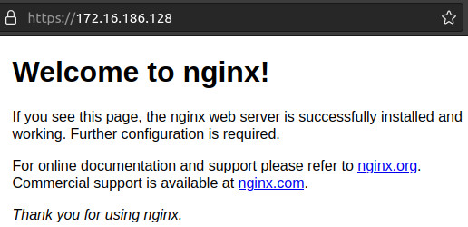
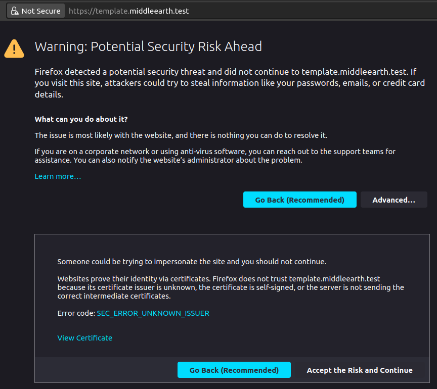

# HashiCorp Vault PKI with Raft backend

- [HashiCorp Vault PKI with Raft backend](#hashicorp-vault-pki-with-raft-backend)
  * [Introduction](#introduction)
  * [Purpose](#purpose)
  * [Prerequisites](#prerequisites)
    + [Operating System](#operating-system)
    + [Software](#software)
    + [Optional, but preferred - this enables convenient copy and paste of root](#optional--but-preferred---this-enables-convenient-copy-and-paste-of-root)
    + [Knowledge](#knowledge)
  * [Quick Start](#quick-start)
  * [Quick Start Explanation - short version](#quick-start-explanation---short-version)
  * [Quick Start Explanation - long version](#quick-start-explanation---long-version)
  * [Creating custom leaf certificates](#creating-custom-leaf-certificates)
  * [Commands](#commands)
    + [Save Vault state (save snapshot)](#save-vault-state--save-snapshot-)
    + [Restore Vault state (restore snapshot)](#restore-vault-state--restore-snapshot-)
    + [Stop Vault server](#stop-vault-server)
    + [Clean up Vault](#clean-up-vault)
    + [Store and retrieve secrets (non PKI)](#store-and-retrieve-secrets--non-pki-)
  * [Revocation](#revocation)
  * [Vault Configuration](#vault-configuration)
  * [Security Concerns](#security-concerns)
  * [Style Convention](#style-convention)
  * [Why the name raft.sh?](#why-the-name-raftsh-)
  * [Improvements](#improvements)
  * [References](#references)


## Introduction

This repo demonstrates [HashiCorp's Vault](https://www.hashicorp.com/products/vault)
product as a Certificate Authority (CA) for Public Key Infrastructure (PKI).
This demo utilizes a raft as a [storage backend](https://www.vaultproject.io/docs/configuration/storage) 
as opposed to a file backend which is typical in many demos/tutorials.
Deploying Vault with raft backend allows for simple backup and recovery of data
via built-in commands.  While there are other features with a raft deployment, 
convienent backup and restoration were significant factors for using raft as a 
backend.  Technically, raft is a [consensous algorithm](https://raft.github.io/),
but that is a digression.


## Purpose

The primary purpose is to provide a development/test environment to learn PKI
with HashiCorp Vault.

This repo (platform) could potentially be used for personal/private networks,
if you accept the shortcomings.  The limitations are the lack comprehensive
features, security best practices and proper deployment of HashiCorp
raft backend infrastructure.


## Prerequisites

### Operating System

- Developed on Ubuntu Linux 22.04 LTS.
- Tested with Bash Shell

Naturally this repo will work with other \*nix Operating Systems and/or Shells
with modification.

### Software

- [HashiCorp Vault](https://www.vaultproject.io/downloads)
    Note: Preferred to install Vault from Hashicorp, while Vault can be
          installed via Snap package, the Snap version does not include
          a GUI console.
- [Jq](https://stedolan.github.io/jq/download/)
- [OpenSSL](https://wiki.openssl.org/index.php/Binaries)

### Optional, but preferred - this enables convenient copy and paste of root
token to login to Vault. (either CLI and/or GUI)
- [xclip](https://github.com/astrand/xclip)

### Knowledge

- Basic understanding of TLS certificates.  If knowledge is limited; this
  platform is great to learn and play with TLS certificates and 
  Certificate Authority (CA)

- Basic understanding of [HashiCorp Vault](https://www.vaultproject.io/).

- Basic knowledge of Linux command line and BASH scripting.


## Quick Start

Clone the Repo:\

```git clone https://github.com/richlamdev/vault-pki-raft.git```\
```cd vault-pki-raft```

Steps:\
```./raft.sh start```\
```./create_root_inter_certs.sh```\
```./issue_cert_template.sh```


## Quick Start Explanation - short version

1. Creates a Certificate Authority from a single Vault instance.

2. Generates a signed leaf certificate, template.middleearth.test.
   This certificate can be deployed to a web server.  Naturally,
   this is just a demo, read below for instruction on how to
   modify the output leaf certificate.

3. Optional: Import the root certificate generated by Vault, to your browser 
   to allow the browser to trust the leaf certifcate presented.


## Quick Start Explanation - long version

The above will perform the following:\
1. Deploys a single Vault instance with a raft backend. - [raft.sh]

    a. This will unseal the vault and login in the current terminal (user)
       as the root user.

    b. This will save the unseal key in the file _unseal_key_ and root
       token in the file _root_token_ in the current folder.  Naturally, this
       not the most secure method to save the _unseal_key_ and _root_token_.
       Actually, a single _unseal_key_ is not the best method for provisioning.
       See Security Concerns section for more information.

    e. After this is complete, the root token is saved to the system buffer.
       This enables convenient login to the vault GUI console.  Visit
       `http://127.0.0.1:8200/` via your browser.  Choose Token method to login
       and paste the root token in the Token field to login.  This step is
       optional, naturally the GUI provides a convenient way to explore
       the certificates and/or actions as resuilt of the CLI commands.

2. Enables Vault PKI Engine and creates a CA - [create_root_inter_certs.sh]

    a. Creates a root certificate and self sign the certificate.
       The root CA is designated by the variable ISSUER_NAME_CN.
       By default the ISSUER_NAME_CN is "Lord of the Rings".
       Change this value if you like.

    b. Creates an intermediate certificate signing request, have the root
       authority sign this certificate and store it within the CA.

    c. Creates a role designated by the variable VAULT_ROLE to sign leaf
       certificates.  Note the value of VAULT_ROLE, itself, is not critical.
       However, the VAULT_ROLE value must be the same in both files,
       _create_root_inter_certs.sh_ and _issue_cert_template.sh_.  This role 
       name is referenced (used) to sign leaf certificates.  If they do not 
       match, an error will occur. Change this value if you like, however keep
       them consistent.  VAULT_ROLE is authorized to sign subdomains indicated
       by the variable DOMAIN, in this case the Second Level Domain (SLD) and
       Top Level Domain(TLD), the default value is "middleearth.test".  Again,
       change this value as you like.

    d. The self-signed CA root certificate and intermediate certificate chain
       are stored in the directory as designated by the variable
       $ROOT_INTER_DIR.  The directory default is _./root_inter_certs_.
       Import the root certificate from this folder to your Operating System
       Trusted Store or Web Browser.  If you're unaware how to import the root
       certificate to either, a quick google search will help you.

3. Issues a \"template\" certificate with a default Subject Common Name (CN)
     template.middleearth.test - [issue_cert_template.sh]

    a. The resulting public certificate, key file, as well as entire signed 
       json blob is stored in directory designated by the variable SUBJECT_CN.
       Edit the HOST and DOMAIN variables to change the default value of
       SUBJECT_CN.  Ensure the value of DOMAIN is the same in both files,
       _create_root_inter_certs.sh_ and _issue_cert_template.sh_.  In this 
       example, the resulting certificate files will be stored in the directory
       _template.middleearth.test_.
<br/>

Inspecting template.middleearth.test certificate via openssl command:


<br/>
<br/>

Optionally deploy the template certificate to a web server for inspection via
web browser.  The below is taken from Nginx in a Ubuntu Virtual Machine
(VM).  Naturally, alternatives would achieve similar results, such as Docker 
with Apache or Nginx, Windows & IIS etc.  The certificate inpsected via Firefox
browser:

<br/>
<br/>

If you import the root certificate to your trusted store or browser update your
local DNS (or update local /etc/hosts file) to resolve 
template.middleaearth.test you will observe the certificate is trusted, denoted 
by the locked padlock symbol in your browser:

<br/>
<br/>

Furthermore, because the template script populates an IP address in the Subject
Alternative Name (SAN) we have "trust" established when visiting the web URL
via IP.  Note, it's atypical to deploy and IP in the SAN for public
certificates, however, for internal/private networks this is your discretion.


<br/>
<br/>

If the root certificate is _not_ imported to the Web browser or added to the 
Operating System trusted store, then an error similar to this will appear:

<br/>
<br/>


## Creating custom leaf certificates

With minimal changes, custom leaf certificates can be generated with these
scripts.

**Subdomain:**\
Edit HOST variable (aka subdomain) in _issue_cert_template.sh_.

**Domain:**\
Edit DOMAIN variable in _create_root_inter_certs.sh_ and
_issue_cert_template.sh_.

**IP Address - Subject Alternative Name:**\
Edit IP_SAN1 variable in _issue_cert_template.sh_.
Optionally omit this variable to remove a IP entry in the SAN.


---OPTIONAL VARIABLES---

**Certificate Authority (Issuer):**\
Edit the ISSUER_NAME_CN variable in _create_root_inter_certs.sh_.

**TTL:**\
Edit the TTL variable (aka expiry) to adjust the validity period of the
certificate in _issue_cert_template.sh_. This number is set in hours, per valid
by Vault software.

Presently the TTL is set for 9552 hours or 398 days.  Set to 398 days as per
default expiry for public leaf certificates governed by major browser
manufacturers, Google, Apple, and Mozilla.  More often than not, many public
certificates have a one year maximum validity period. (sometimes less, in
the case of automated certifcate renewals, such as Let's Encrypt).
Naturally, in the case of development or private environment set the length to
your desire.  Note that it cannot exceed the TTL of the root CA, which is
default 10 years.  Refer to References section below for more information.


## Commands

### Save Vault state (save snapshot)

To make a backup, or a snapshot of any certifcates (secrets) stored in Vault
run the following command:\
```./raft.sh save```

This will save the state in the current folder under a folder named
*backup_xxxx*.  Where xxxx is a random identifier generated.  The purpose
of the unique identifier is to distinguish between multiple saved states.

Each backup folder will contain three files:\
-the snapshot file itself, named _snapshotxxxx_\
-the unseal key, saved in the file named _unseal_keyxxxx_\
-the root token, saved in the file named _root_tokenxxxx_\

When a snapshot is taken, the matching unseal key and root
token must be used to access the vault when a snapshot is restored.  This is
performed transparently by this script.  Refer to below Restore section for
more information.

### Restore Vault state (restore snapshot)

To restore a backup, or a snap of any previously saved state run the following
command:\
```./raft.sh restore backup_xxxx```

This will unseal the vault and login in the current terminal (user) as the
root user with the associated backup unseal key and root token.

Any previously generated certificates or other stored data within the Vault
will be restored.

### Stop Vault server

To stop the Vault server process, run the following command:\
```./raft.sh stop```

This will stop the current Vault service, remove the storage folder, and
delete the associated unseal key and root token.

If there is data (secrets) to be kept with the working Vault session, run
the command before stopping the sessions.  Refer to Save Vault state section.

### Clean up Vault

To clean up all certificates and backup folders, run the following command:\
```./raft.sh cleanup```

In addition to executing ```./raft.sh stop```, cleanup will also remove the 
root and intermediate certificates, all domain certificates created and the all
backup folders.

This command is destructive and is primarily used to sanitize the 
working folder.


### Store and retrieve secrets (non PKI)

A couple miscellaneous functions have been left in _raft.sh_ as random
functions to demonstrate basic secret storage and retrieval within Vault.
These functions are irrelevant to PKI, arguably do not belong here,
however they remain in this script as basic examples.

To enable a secrets engine named kv and store a value at kv/apikey with
hardcoded example data _webapp=AAABBB238472320238CCC_, run the command:

```./raft.sh putdata```

To retrieve and display the above stored data run the following command:

```./raft.sh getdata```


## Revocation

If this repo / deployment is used as an ephemeral instance, revocation
will not work without alternative configuration/additional servers.  Web
browsers or clients need to verify validity of certificates against a
Certificate Revocation List (CRL) or via a Online Certificate Status Protocol
(OCSP) server.

If this repo is only used for learning/development, revocation is moot.  If
this is to be used for a personal home network, then you can determine your
risk tolerance and/or alternatives for maintaining certificate revocation and/
or expiry.

An alternative to verifying certificate validity against a CRL or OCSP would be
to set short certificate expiry (aka Time-To-Live (TTL)).  Doing so would
require new certificates to be issued frequently, and preferably in an 
automated fashion.  This would also require a Vault instance to deployed
permanently...

For further information regarding certificate revocation, refer to the links
in the Reference section.


## Vault Configuration

The file _vault_config.hcl_ is the configuration file for the Vault server.
The configuration is fairly straight forward, for more information please refer
to the [HashiCorp documentation](https://developer.hashicorp.com/vault/docs/configuration).


## Security Concerns

This is *not* meant for a production environment for several reasons.  Some
brief points below why:

1.  This deployment is a single instance.  This is not a reslient deployment.

2.  Vault is configured with a single seal token.  Typically, five tokens are
created and a requires a minimum of three tokens to unseal.

3.  The unseal token is exported/displayed in plain-text.  A preferred method
would be to export and encrypt the token with a public PGP key of the person(s)
responsible for maintenance.

4.  The root token is writen to disk.  For a typical deployment, according to
Hashicorp best practices, would be to [destroy the root token](https://developer.hashicorp.com/vault/docs/concepts/tokens#root-tokens)
after the root token has been utlized to setup Vault.

5.  The secret certificate (key) for generated certificates are written to the
local disk.  The intenion here was to have all generated certificates
readily available to inspect for learning purposes.  Naturally storing secret
certificates (keys) should be stored securely.  Exposed secret certificates
compromises secrecy/trust and defeats the purpose of a Public Key
Infrastructure(PKI)!


## Style Convention

The Bash scripts were written to adhere as close as possible to [Google's Shell
Style Guide](https://google.github.io/styleguide/shellguide.html)


## Why the name raft.sh?
The reason the Vault script is name _raft.sh_ is for convenience of execution.
Start to type ```./r``` followed by ```tab``` to autocomplete ```./raft.sh```
followed by the subcommand to execute the desired command.


## Improvements

- Create a bash script to accept configuration parameters as command line
arguments instead of editing the script directly.


## References

[HashiCorp Storage Backend](https://www.vaultproject.io/docs/configuration/storage)\
[HashiCorp Vault Backup](https://learn.hashicorp.com/tutorials/vault/sop-backup)\
[HashiCorp Vault Restore](https://learn.hashicorp.com/tutorials/vault/sop-restore)\
[smallstep PKI article](https://smallstep.com/blog/everything-pki/)\
[Mozilla Blog - Public Certificate Expiry](https://blog.mozilla.org/security/2020/07/09/reducing-tls-certificate-lifespans-to-398-days/)
